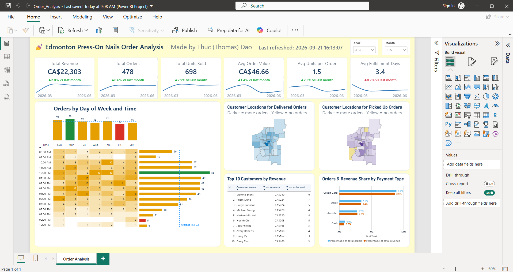
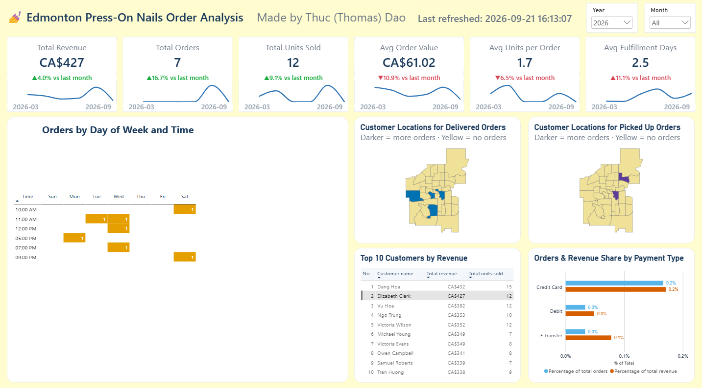

# Edmonton Press-On Nails Order Analysis

<mark>💡 Click any section title below (or the ▶︎ / ▼ symbol) to open or close that section.</mark>

An interactive Power BI dashboard built for a home-based press-on nails business in Edmonton, Alberta, giving a full view of revenue, order timing, customer geography, and payment behavior in one page.



> **Data note:** all figures in this project, including revenue, units sold, customer names, and postal codes, are **synthetic**. The data was generated to build and demo this report. No real customer or financial data is exposed here.

<details open>
<summary><h2>What's in the dashboard</h2></summary>

- **KPI row**: six cards (Total Revenue, Total Orders, Total Units Sold, Avg Order Value, Avg Units per Order, Avg Fulfillment Days), each with a monthly trend sparkline and a month-over-month % change.
- **Orders by Day of Week and Time**: a day/hour heatmap paired with a column chart (totals by day) and a bar chart (totals by hour), both with dynamic average reference lines and discrete red/green highlighting on the single lowest and highest value, correctly handling ties.
- **Customer Locations**: two choropleth maps of Edmonton, built from a custom FSA boundary file, splitting order density by delivery method (delivered vs. picked up).
- **Top 10 Customers by Revenue**: a leaderboard table.
- **Orders & Revenue Share by Payment Type**: comparing each payment method's share of order count against its share of revenue.
- **Year / Month slicers** driving every visual on the page.
- **Cross-filtering**: selecting a customer in the leaderboard filters the heatmap to that customer's orders alone and automatically hides the column/bar charts when there's too little data to chart meaningfully; deselecting restores the full view.



*From the whole business to a single customer: with one synthetic customer selected, the KPI cards, both maps, and the payment chart re-scope to that customer's 7 orders (CA$427).*

See the [`Screenshots/`](Screenshots) folder for the full visual tour, both the whole-page view and close-ups of the interactive details.

</details>

<details>
<summary><h2>Tech stack</h2></summary>

- **Power BI Desktop**, authored in the **PBIP** (Power BI Project) format, report and semantic model as plain-text files, diffable and version-controllable.
- **DAX** for all measures, including trend calculations, month-over-month deltas, and dynamic min/max comparison logic.
- A custom color theme applied consistently across every visual type.

</details>

<details>
<summary><h2>Repository structure</h2></summary>

```
power-bi-order-analysis/
├── Order_Analysis.pbip              # Open this in Power BI Desktop
├── Order_Analysis.pbix              # Packaged export, no PBIP support needed
├── Edmonton_FSA_Boundaries.json     # Geo-boundary file used by the two maps
├── press_on_nails_orders.csv        # Source data (synthetic)
├── Order_Analysis.Report/           # Report definition: pages, visuals, theme
├── Order_Analysis.SemanticModel/    # Data model: tables, relationships, DAX measures
└── Screenshots/                     # 01.png–10.png, the visual tour
```

</details>

<details>
<summary><h2>Why there are two files: <code>.pbip</code> and <code>.pbix</code></h2></summary>

Both open the same dashboard in Power BI Desktop. They differ in how it is stored.

| | `Order_Analysis.pbix` | `Order_Analysis.pbip` |
|---|---|---|
| Format | One binary file | A small pointer file plus folders of plain-text files |
| What's inside | Report layout, data model, and imported data packed together | The report as JSON (one file per page and per visual) and the data model as TMDL text files (tables, relationships, DAX measures) |
| Readable by people, Git, or AI | No | Yes |
| Best for | Opening or sharing the finished dashboard as a single file | Editing, reviewing changes line by line, version control |

**Why the PBIP format was needed to build this with Claude Code.** Claude Code works by reading and editing text files, and it cannot meaningfully read or edit a binary `.pbix`. In a PBIP project, every measure and every visual is a text file, so Claude Code could write DAX measures, adjust visual formatting, and validate the result against Microsoft's published schemas, while Power BI Desktop reloaded the project to show the outcome. It also means the whole build history lives in Git.

In this repo the **`.pbip` project is the source of truth**. The `.pbix` is a packaged copy saved from the finished project, included for anyone who just wants to open the dashboard. If you change the project later, re-save the `.pbix` to keep the two in sync.

</details>

<details>
<summary><h2>Why Shape Map instead of Azure Maps</h2></summary>

The two Edmonton maps are Power BI **Shape Map** visuals. The first version used the **Azure Maps** visual, and I switched for three reasons:

1. **It needed an account I don't have.** The Azure Maps visual asked me to sign in with a work account before it would show anything. As an individual user without an organizational account, I couldn't get past that, while Shape Map works with no sign-in at all.
2. **Shape Map fits the question better.** The data is organized by postal-code area (FSA), and the goal is to shade each area by how many orders it has. Shape Map does exactly that: it matches each FSA to an outline in a boundary file and colors the area by value. The Azure Maps visual is built around plotting points and bubbles on a street map, with locations looked up (geocoded) by Azure.
3. **Location data stays out of an external geocoder.** Azure Maps may send the values in its Location field to Azure to look up coordinates, and it pulls map tiles from a cloud service. Shape Map just matches values to IDs in a file that ships with the report. The data here is synthetic, so nothing sensitive is at stake, but with real customers this difference would matter.

**Trade-offs.** Shape Map is pickier. It needs a boundary file in the right format (see the next section), and the polygons had to be re-wound clockwise before they rendered as separate areas instead of one solid block. It also has no street-map background and no gradient legend bar, so each map's subtitle ("Darker = more orders · Yellow = no orders") does the legend's job.

Microsoft's docs: [Azure Maps Power BI visual](https://learn.microsoft.com/en-us/azure/azure-maps/power-bi-visual-get-started) and [Shape map](https://learn.microsoft.com/en-us/power-bi/visuals/power-bi-shape-map).

</details>

<details>
<summary><h2>Map boundary data</h2></summary>

`Edmonton_FSA_Boundaries.json` drives the two Edmonton maps. Power BI's Shape Map needs outlines to match against the data, here each customer's FSA (the first three characters of a postal code, for example `T5A`).

**Source.** Statistics Canada, *Census Forward Sortation Area Boundary File*, 2021 Census (catalogue no. 92-179-X). I started from a simplified, Canada-wide GeoJSON copy of that data published by [sachijay/canada_maps](https://github.com/sachijay/canada_maps) (MIT licensed).

**What Claude Code changed to make it work in this dashboard:**

1. Kept only the 38 FSAs covering Edmonton (the T5 and T6 areas), dropping the rest of the country.
2. Converted the coordinates from projected, metre-based values to standard WGS84 latitude/longitude.
3. Trimmed the attributes to just the FSA code and province name, and renamed the code field to `FSA` so it lines up with the model's `Customer_FSA` column.
4. Simplified the outlines further (keeping every shape intact) and cleaned the geometry so the file stays small.
5. Exported it as TopoJSON, the format Power BI's Shape Map reads, using the `FSA` value as each shape's ID. The result is 38 polygons in about 9 KB.

Power BI also keeps its own embedded copy of this file for each map under `Order_Analysis.Report/StaticResources/RegisteredResources/`, which is why two extra copies appear there.

</details>

<details>
<summary><h2>Running it locally</h2></summary>

1. Clone the repo.
2. Open `Order_Analysis.pbip` in Power BI Desktop (requires PBIP support, enabled by default in recent versions). Alternatively, open `Order_Analysis.pbix` directly if you don't need the project source files.
3. All data is embedded/imported from `press_on_nails_orders.csv` and the included boundary file, no external connections or credentials needed.

</details>

<details>
<summary><h2>How this was built</h2></summary>

This dashboard was built almost entirely in conversation with [Claude Code](https://claude.com/claude-code), using the official [Microsoft Power BI Report Authoring skill](https://github.com/microsoft/skills-for-fabric/tree/main/plugins/powerbi-authoring/skills) for live model verification and report authoring. I wrote about the process, including what the AI handled well and the two things that still needed a human, in [this LinkedIn article](https://www.linkedin.com/pulse/dashboard-ai-finished-95-alone-thuc-dao-ite3c/).

</details>

<details>
<summary><h2>License</h2></summary>

This project is licensed under the [MIT License](LICENSE).

**What the license covers:** the work I created for this dashboard, namely the DAX measures, the report and data model definitions (`Order_Analysis.Report/` and `Order_Analysis.SemanticModel/`), the `.pbip` and `.pbix` files, the synthetic order data, the screenshots, and this README.

**What it does not cover:** `Edmonton_FSA_Boundaries.json`, including the copies Power BI embeds in the report. It is derived from Statistics Canada data (via [sachijay/canada_maps](https://github.com/sachijay/canada_maps)), so it remains subject to the terms of those original sources. See the "Map boundary data" section above for details.

</details>
